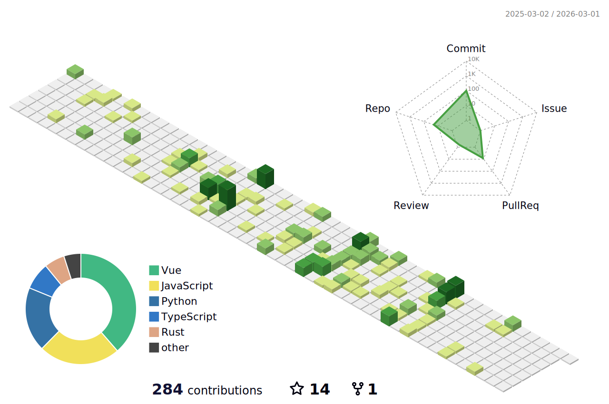

<!--
**vumichien/vumichien** is a ✨ _special_ ✨ repository because its `README.md` (this file) appears on your GitHub profile.

Here are some ideas to get you started:

- 🔭 I’m currently working on ...
- 🌱 I’m currently learning ...
- 👯 I’m looking to collaborate on ...
- 🤔 I’m looking for help with ...
- 💬 Ask me about ...
- 📫 How to reach me: ...
- 😄 Pronouns: ...
- ⚡ Fun fact: ...

 

-->

🙋‍♀️ Hi there!

💼 Connect with me:

[LinkedIn](https://www.linkedin.com/in/vumichien/) || [Google Scholar](https://scholar.google.com/citations?user=wcbZoCgAAAAJ&hl=en) || [Semantic Schorlar](https://www.semanticscholar.org/author/Minh-Chien-Vu/1484109150)

<!--

-->

	<picture>
	  <source media="(prefers-color-scheme: dark)"  srcset="https://raw.githubusercontent.com/vumichien/vumichien/main/profile-3d-contrib/profile-night-rainbow.svg" />
	  <source media="(prefers-color-scheme: light)" srcset="https://raw.githubusercontent.com/vumichien/vumichien/main/profile-3d-contrib/profile-green-animate.svg" />
	  
	</picture>

