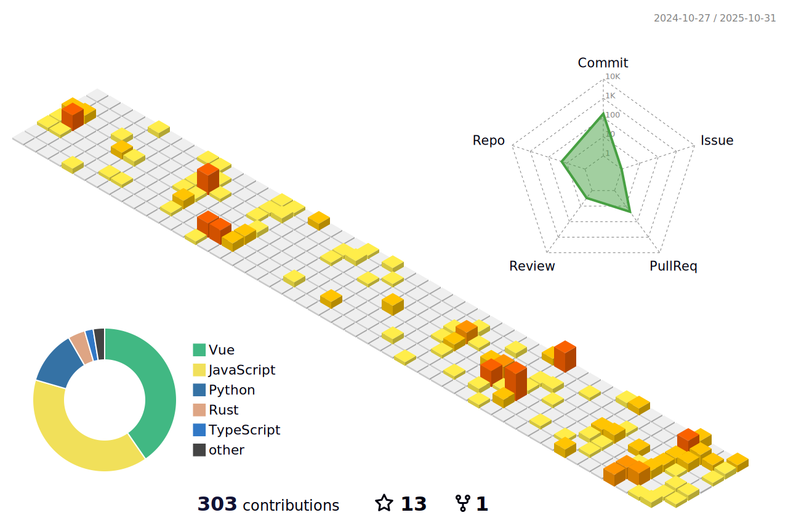

<!--
**vumichien/vumichien** is a ✨ _special_ ✨ repository because its `README.md` (this file) appears on your GitHub profile.

Here are some ideas to get you started:

- 🔭 I’m currently working on ...
- 🌱 I’m currently learning ...
- 👯 I’m looking to collaborate on ...
- 🤔 I’m looking for help with ...
- 💬 Ask me about ...
- 📫 How to reach me: ...
- 😄 Pronouns: ...
- ⚡ Fun fact: ...

 

-->
💻 Introduction:

🙋‍♀️ Hi there! I'm a Data Scientist.

🧠 Job Description:
📊 As a Data Scientist, I use statistical analysis, machine learning, and data visualization to help organizations make informed decisions based on data.

🔎 Skills:

💻 Proficient in programming languages such as Python
📈 Experienced in data analysis and statistical modeling
📊 Knowledgeable in data visualization tools like Tableau and Matplotlib

💼 Experience:

💼 Worked on various projects involving data analysis and predictive modeling for clients in different industries.
💼 Developed and deployed machine learning models to enhance business processes and improve decision-making.

💻 Ready to work on new and exciting projects, and help organizations turn data into insights and action.
<!--

-->

	<picture>
	  <source media="(prefers-color-scheme: dark)"  srcset="https://raw.githubusercontent.com/vumichien/vumichien/main/profile-3d-contrib/profile-night-rainbow.svg" />
	  <source media="(prefers-color-scheme: light)" srcset="https://raw.githubusercontent.com/vumichien/vumichien/main/profile-3d-contrib/profile-green-animate.svg" />
	  
	</picture>

